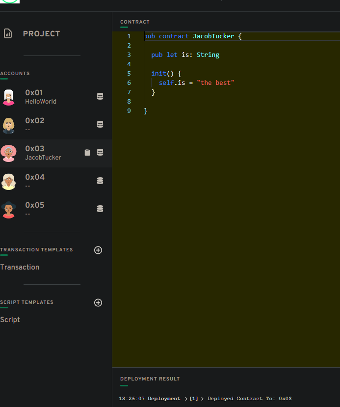
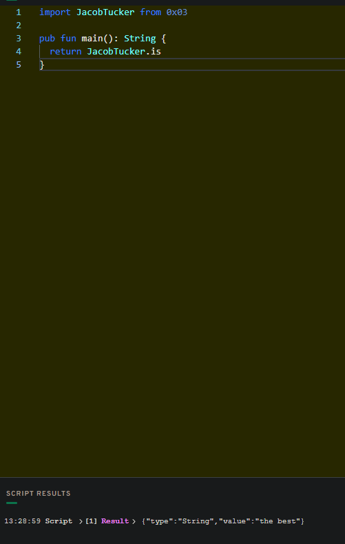
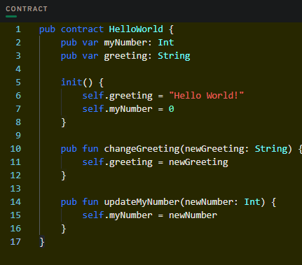
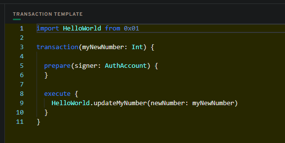
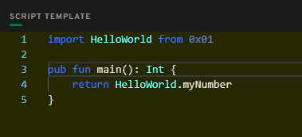
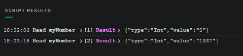

# Chapter 2
## Day 1

##### Contract Deployment

##### Script Result

## Day 2

##### Explain why we wouldn't call changeGreeting in a script.

Because we can't change anything through the script, it's only to view the info on a blockchain. We need to send transaction.

##### What does the AuthAccount mean in the prepare phase of the transaction?

It's to give access to the data that stored at user's account.

##### What is the difference between the prepare phase and the execute phase in the transaction?

The prepare phase is where we get access to the account or data. And we can't do that in the execute phase. But we can do everything else in that phase. Actually the execute phase is not really needed in transaction, everyting can be done in the prepare phase. But it used to seperate the logic of the code and to give more clarity. And that's very important as we already talked about in Chapter 1.

##### The Quest

Contract code:

Transaction code:

Script code:

Script results (before and after running a transaction):

