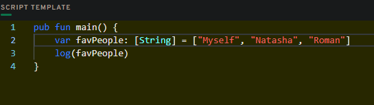

# Chapter 2
## Day 3

#### In a script, initialize an array (that has length == 3) of your favourite people, represented as Strings, and log it.




#### In a script, initialize a dictionary that maps the Strings Facebook, Instagram, Twitter, YouTube, Reddit, and LinkedIn to a UInt64 that represents the order in which you use them from most to least. For example, YouTube --> 1, Reddit --> 2, etc. If you've never used one before, map it to 0!


#### Explain what the force unwrap operator ! does, with an example different from the one I showed you (you can just change the type).


####	Using this picture below, explain...

- What the error message means
- Why we're getting this error
- How to fix it


Values of a dictionary are always an optionals. Function above should always returns 'String', but in fact it can return 'nil'. To fix this we can force-unwrap a return by adding '!' like this: 
```javascript
return thing[0x03]!
```
but better to add an optinal suffix to the call type like this:
```javascript
pub fun main(): String? {
...
}
```