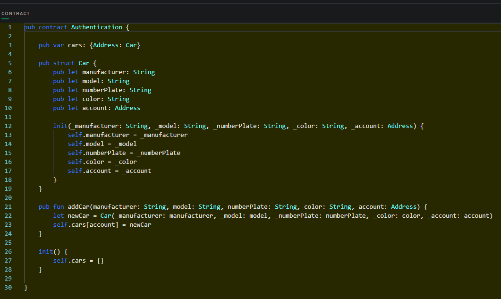
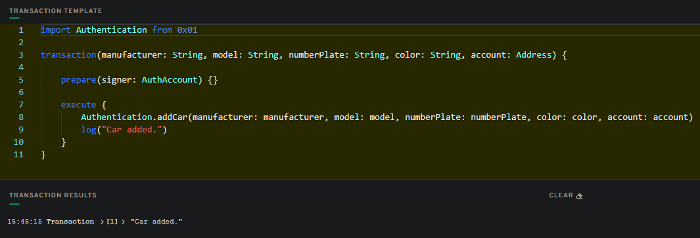
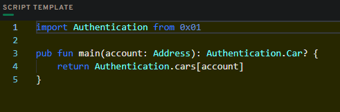

# Chapter 2
## Day 4

Hey, why does Jacob call me an idiot? I'm not an idiot >.<

#### 1. Deploy a new contract that has a Struct of your choosing inside of it (must be different than Profile).

#### 2. Create a dictionary or array that contains the Struct you defined.

#### 3. Create a function to add to that array/dictionary.



#### 4. Add a transaction to call that function in step 3.



#### 5. Add a script to read the Struct you defined.



##### Result:

```javascript
{"type":"Optional","value":{"type":"Struct","value":{"id":"A.0000000000000001.Authentication.Car","fields":[{"name":"manufacturer","value":{"type":"String","value":"BMW"}},{"name":"model","value":{"type":"String","value":"X9"}},{"name":"numberPlate","value":{"type":"String","value":"KVY079"}},{"name":"color","value":{"type":"String","value":"Black"}},{"name":"account","value":{"type":"Address","value":"0x0000000000000003"}}]}}}
```