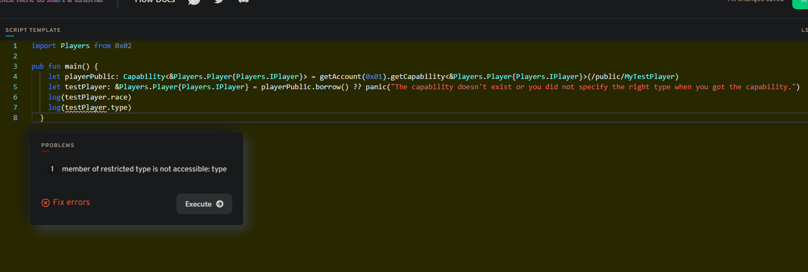
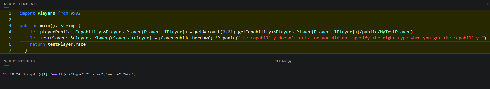

# Chapter 4
## Day 1

#### 1. Explain what lives inside of an account.

- Contracts: Contracts (one or multiple) gets deployed and lives there.
- Data Storage: All data gets stored there. 

#### 2. What is the difference between the '/storage/', '/public/', and '/private/' paths?

It's part of Account Storage.
- ALL data gets stored in '/storage/' and only owner has access to it.
- 'public' is a path where data is available for everyone.
- 'private' is a path where you can share some data.

#### 3. What does '.save()' do? What does '.load()' do? What does '.borrow()' do?

It's a functions to interact with account's data.
- '.save()' is to write something in account's storage
- '.load()' is to take out data of account's storage
- '.borrow()' is to get reference of some data of account's storage (so we are not moving anything out of the account :) )

#### 4. Explain why we couldn't save something to our account storage inside of a script.

We can't change anything on the blockchain through the script. Still only to read something.

#### 5. Explain why I couldn't save something to your account.

Because owner of the account need to sign a transaction with the 'AuthAccount' type.

#### 6. Define a contract that returns a resource that has at least 1 field in it. Then, write 2 transactions:

```cadence

pub contract Players {

    pub resource interface IPlayer {
        pub var type: Int
    }

    pub resource Player: IPlayer {
        pub var race: String
        pub var type: Int
        init(_race: String, _type: Int) {
            self.race = _race
            self.type = _type
        }
    }

    pub fun createPlayer(race: String, type: Int): @Player {
        return <- create Player(_race: race, _type: type)
    }

    init() {}
}

```

##### A transaction that first saves the resource to account storage, then loads it out of account storage, logs a field inside the resource, and destroys it:

```cadence
import Players from 0x02

transaction (race: String, type: Int) {

  prepare(signer: AuthAccount) {
    let testPlayer <- Players.createPlayer(race: race, type: type)
    signer.save(<- testPlayer, to: /storage/MyTestResource)
    let loadPlayer <- signer.load<@Players.Player>(from: /storage/MyTestResource) ?? panic ("No resource there")
    log(loadPlayer.race)
    destroy loadPlayer
  }

  execute {}

}
```

##### A transaction that first saves the resource to account storage, then borrows a reference to it, and logs a field inside the resource.:

```cadence
import Players from 0x02

transaction (race: String, type: Int) {

  prepare(signer: AuthAccount) {
    let testPlayer <- Players.createPlayer(race: race, type: type)
    signer.save(<- testPlayer, to: /storage/MyTestResource)
    let borrowPlayer = signer.borrow<&Players.Player>(from: /storage/MyTestResource) ?? panic ("No resource there")
    log(borrowPlayer.race)
  }

  execute {}

}
```

## Day 2

#### 1. What does .link() do?

It's the function to "link" our data to '/public/' or '/private/'. This "link" has the name - capability. 

#### 2. In your own words (no code), explain how we can use resource interfaces to only expose certain things to the '/public/' path.

When creating capability we can use interface to only expose fields that we want to be exposed. For example resource can have many members and functions inside. 
But for example if we want only one member to be publicly available than we can use resource interface that have only that one member inside. So we don't expose things we don't want to be exposed.

#### 3. Deploy a contract that contains a resource that implements a resource interface. Then, do the following:

```cadence

pub contract Players {

    pub resource interface IPlayer {
        pub var type: Int
    }

    pub resource Player: IPlayer {
        pub var race: String
        pub var type: Int
        init(_race: String, _type: Int) {
            self.race = _race
            self.type = _type
        }
    }

    pub fun createPlayer(race: String, type: Int): @Player {
        return <- create Player(_race: race, _type: type)
    }

    init() {}
    }

```

##### In a transaction, save the resource to storage and link it to the public with the restrictive interface:

```cadence

import Players from 0x02

transaction (race: String, type: Int) {

  prepare(signer: AuthAccount) {
    let testPlayer <- Players.createPlayer(race: race, type: type)
    signer.save(<- testPlayer, to: /storage/MyTestPlayer)
    signer.link<&Players.Player{Players.IPlayer}>(/public/MyTestPlayer, target:/storage/MyTestPlayer)
  }

  execute {}

}

```

##### Run a script that tries to access a non-exposed field in the resource interface, and see the error pop up:

```cadence



```

##### Run the script and access something you CAN read from. Return it from the script:

```cadence



```