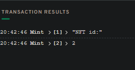
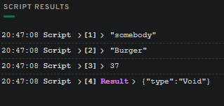

# Chapter 5
## Day 3

#### 1. What does "force casting" with 'as!' do? Why is it useful in our Collection?

When using force casting with 'as!' we can be sure that this particular @NonFungibleToken.NFT will be our @NFT type, not some other @NonFungibleToken.NFT from other Collection. So for example using force casting in our deposit function we can be sure anyone can only deposit in our Collection only "right" NFTs.

#### 2. What does 'auth' do? When do we use it?

It is used to get authorized reference. So for example if our NFT have some specific fields besides 'id', we should downcast it using 'as!' to be &NFT type, because &NonFungibleToken.NFT only have that 'id' member. But to downcast it, we need to get authorized reference with 'auth'.

#### 3. This last quest will be your most difficult yet. Take this contract:

*no original contract, sorry*

and add a function called borrowAuthNFT just like we did in the section called "The Problem" above. Then, find a way to make it publically accessible to other people so they can read our NFT's metadata. Then, run a script to display the NFTs metadata for a certain id.

You will have to write all the transactions to set up the accounts, mint the NFTs, and then the scripts to read the NFT's metadata. We have done most of this in the chapters up to this point, so you can look for help there :)

#### Updated contract with borrowAuthNFT and the resource interface for using it:

```cadence

import NonFungibleToken from 0x02
pub contract CryptoPoops: NonFungibleToken {
  pub var totalSupply: UInt64

  pub event ContractInitialized()
  pub event Withdraw(id: UInt64, from: Address?)
  pub event Deposit(id: UInt64, to: Address?)

  pub resource NFT: NonFungibleToken.INFT {
    pub let id: UInt64

    pub let name: String
    pub let favouriteFood: String
    pub let luckyNumber: Int

    init(_name: String, _favouriteFood: String, _luckyNumber: Int) {
      self.id = self.uuid

      self.name = _name
      self.favouriteFood = _favouriteFood
      self.luckyNumber = _luckyNumber
    }
  }
	
	// That's the interface we would use to view metadata later
  pub resource interface CollectionAuth {
      pub fun borrowAuthNFT(id: UInt64): &NFT
  }

	// Added CollectionAuth interface to the resource
  pub resource Collection: NonFungibleToken.Provider, NonFungibleToken.Receiver, NonFungibleToken.CollectionPublic, CollectionAuth {
    pub var ownedNFTs: @{UInt64: NonFungibleToken.NFT}

    pub fun withdraw(withdrawID: UInt64): @NonFungibleToken.NFT {
      let nft <- self.ownedNFTs.remove(key: withdrawID) 
            ?? panic("This NFT does not exist in this Collection.")
      emit Withdraw(id: nft.id, from: self.owner?.address)
      return <- nft
    }

    pub fun deposit(token: @NonFungibleToken.NFT) {
      let nft <- token as! @NFT
      emit Deposit(id: nft.id, to: self.owner?.address)
      self.ownedNFTs[nft.id] <-! nft
    }

    pub fun getIDs(): [UInt64] {
      return self.ownedNFTs.keys
    }

    pub fun borrowNFT(id: UInt64): &NonFungibleToken.NFT {
      return (&self.ownedNFTs[id] as &NonFungibleToken.NFT?)!
    }
	
	// Here is the borrowAuthNFT function!
    pub fun borrowAuthNFT(id: UInt64): &NFT {
        let ref = (&self.ownedNFTs[id] as auth &NonFungibleToken.NFT?)!
          return ref as! &NFT
    }

    init() {
      self.ownedNFTs <- {}
    }

    destroy() {
      destroy self.ownedNFTs
    }
  }

  pub fun createEmptyCollection(): @NonFungibleToken.Collection {
    return <- create Collection()
  }

  pub resource Minter {

    pub fun createNFT(name: String, favouriteFood: String, luckyNumber: Int): @NFT {
      return <- create NFT(_name: name, _favouriteFood: favouriteFood, _luckyNumber: luckyNumber)
    }

    pub fun createMinter(): @Minter {
      return <- create Minter()
    }

  }

  init() {
    self.totalSupply = 0
    emit ContractInitialized()
    self.account.save(<- create Minter(), to: /storage/Minter)
  }
}


```

We would create a collection with 0x01 and mint NFT for that address. 0x03 will be minter, because it's where we deployed out CryptoPoops contract.

#### Transaction #1. User should create empty collection to receive NFTs. Signer: 0x01

```cadence

import NonFungibleToken from 0x02
import CryptoPoops from 0x03

transaction() {
  prepare(signer: AuthAccount) {

    // Only the signer of the transaction can create a collection to store NFTs
    signer.save(<- CryptoPoops.createEmptyCollection(), to: /storage/CryptoPoopsCollection)

    // Linking collection to public
    signer.link<&CryptoPoops.Collection{NonFungibleToken.CollectionPublic, CryptoPoops.CollectionAuth}>(/public/CryptoPoopsCollection, target: /storage/CryptoPoopsCollection)
  }
}

```

#### Transaction #2. Minting NFT for 0x01. Inputs: somebody, Burger, 37, 0x01. Signer: 0x03.

```cadence

import NonFungibleToken from 0x02
import CryptoPoops from 0x03

// Only account that deployed the contract can mint NFTs at first, because only that account has Minter resource.
// That account can "create" new Minters aswell but we won't do that for now.

transaction (name: String, favouriteFood: String, luckyNumber: Int, address: Address) {

  prepare(signer: AuthAccount) {
  let minter = signer.borrow<&CryptoPoops.Minter>(from: /storage/Minter)
              ?? panic("You don't have 'Minter' resource that required for minting")

  let addressCollection = getAccount(address).getCapability(/public/CryptoPoopsCollection)
                            .borrow<&CryptoPoops.Collection{NonFungibleToken.CollectionPublic}>() 
                            ?? panic("That address doesn't have a Collection. Ask him to create one")

                            // NonFungibleToken.Receiver is minimal required interface to deposit, we could use NonFungibleToken.CollectionPublic aswell

    // Mint the NFT using the reference to the `minter` we have with metadata we provide
    let nft <- minter.createNFT(name: name, favouriteFood: favouriteFood, luckyNumber: luckyNumber)
    
    // Logging id of NFT we minted
    log("NFT id:")
    log(nft.id)

    // Deposit the NFT in the Collection of desired address
    addressCollection.deposit(token: <- nft)

  }
}

```

Transaction log:



#### Final script. Here we will look at metadata of 0x01's NFT with id 2 (logged above).

```cadence

import NonFungibleToken from 0x02
import CryptoPoops from 0x03

pub fun main(id: UInt64, address: Address) {


  // Getting a public collection with the Auth interface of the input address
  let addressCollection = getAccount(address).getCapability(/public/CryptoPoopsCollection)
                            .borrow<&CryptoPoops.Collection{CryptoPoops.CollectionAuth}>() 
                            ?? panic("That address doesn't have a Collection. So there's nothing to look at :(")

  let nft = addressCollection.borrowAuthNFT(id: id)

  log(nft.name)
  log(nft.favouriteFood)
  log(nft.luckyNumber)

}

```

Script result:

